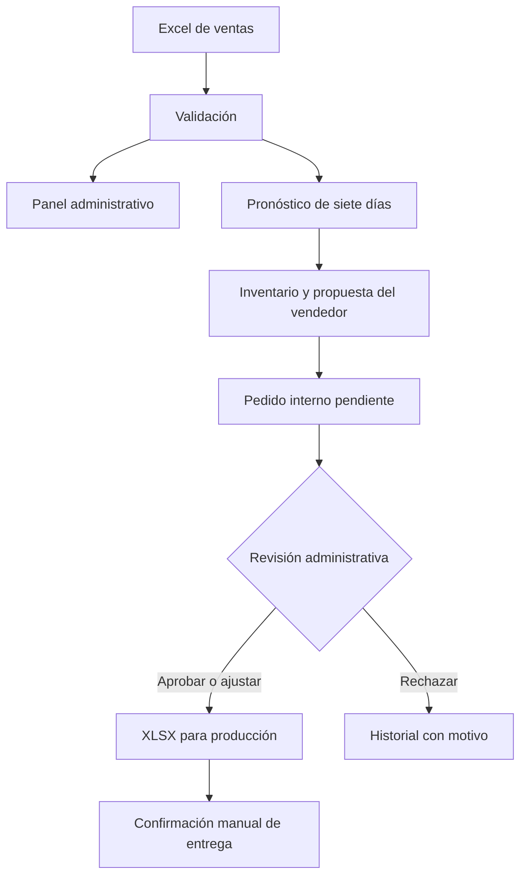

<h1 align="center">SmartOrder AI</h1>

<p align="center">
  <strong>Sistema inteligente de pedidos sugeridos para Vitali Alimentos</strong><br>
  Ventas observadas, pronóstico de demanda y revisión humana en un solo flujo de pedidos.
</p>

---

**Contenido:** [Flujo](#cómo-funciona) · [Indicadores](#paneles-e-indicadores) · [Cálculo](#cómo-se-calcula-un-pedido) · [Excel](#fuente-de-datos) · [Uso local](#ejecutar-en-windows) · [Despliegue](#despliegue-en-streamlit-community-cloud) · [Código y pruebas](#organización-del-código-y-verificación)

SmartOrder AI ayuda a decidir **qué producto pedir, cuánto solicitar y para qué fecha**. Administración carga el histórico de ventas desde Excel; cada vendedor consulta sus clientes, registra inventario y envía una solicitud interna; administración la revisa y prepara un archivo para producción.

| Alcance actual | Fuente | Horizonte | Salida |
| --- | --- | --- | --- |
| Cliente y producto | Excel de ventas cargado por administración | Pronóstico de siete días | XLSX de pedidos revisados para producción |

> [!IMPORTANT]
> El archivo recibido se llama `Demo_Ventas_Avicola_2025_IA_Pedidos_v2.xlsx`. Sus cifras describen ese archivo de ejemplo y **no acreditan ventas, ahorros ni reducción de mermas reales de Vitali**. Tampoco contiene sucursal, SKU ni unidad oficial por producto; esas funciones requieren fuentes adicionales.

## Cómo funciona



El vendedor conserva la decisión sobre la cantidad que solicita. Administración puede aprobarla, cambiarla con una explicación o rechazarla. **Exportado** significa que administración confirmó haber descargado y compartido el XLSX; el sistema no recibe un acuse de la planta ni crea órdenes directamente en un ERP.

### Funciones por rol

| Administración | Vendedor |
| --- | --- |
| Carga y activa el Excel; consulta cobertura y calidad de los datos. | Ve solo los clientes asignados y sus productos. |
| Filtra ventas por fecha y cliente; ve ingresos, evolución mensual, canales y productos en gráficos. | Consulta ventas comparables, pronóstico de siete días y explicación de la recomendación. |
| Crea cuentas, asigna clientes y restablece contraseñas. | Registra unidad, inventario, pedidos pendientes y reglas comerciales. |
| Revisa solicitudes, documenta ajustes o rechazos y exporta el lote aprobado. | Indica la fecha requerida, envía la solicitud y sigue su estado. |

### Estados de una solicitud

| Estado | Significado |
| --- | --- |
| **Pendiente** | El vendedor la envió y espera revisión. |
| **Aprobado** | Administración la revisó; está lista para incluirse en un XLSX. |
| **Rechazado** | Administración registró el motivo del rechazo. |
| **Sustituido** | Existe una solicitud más reciente para el mismo cliente, producto e inicio de período. |
| **Fuente sustituida** | Cambió el Excel antes de entregar ese pedido; debe generarse otro con la fuente vigente. |
| **Exportado** | Administración confirmó manualmente que compartió el archivo con producción. |

Para evitar pedir dos veces por la misma demanda, el sistema impide que queden vigentes pedidos de un mismo cliente y producto con horizontes de siete días superpuestos. Una solicitud pendiente puede reemplazarse por otra que inicie en la misma fecha. La fecha de entrega solicitada debe estar dentro del horizonte del pronóstico.

## Paneles e indicadores

**Resumen de administración.** Incluye filtros de período y cliente; ventas en USD, registros, clientes y productos con ventas; gráfico de evolución mensual, gráfico circular por canal de venta, barras por producto y conteos de pedidos pendientes, aprobados y exportados.

**Cartera del vendedor.** Muestra productos del cliente asignado, ventas en USD, registros y cantidades dentro de la medida original del Excel. Si existe información del mismo mes del año anterior, la usa como comparación; en otro caso, muestra el histórico disponible y lo indica.

**Recomendaciones.** Presenta el pronóstico, los datos comparables, el método aplicado, la cantidad sugerida y su explicación. Las métricas técnicas WAPE y MAE se mantienen aparte, en **Datos y modelo → Diagnóstico del pronóstico**, desglosadas por producto. El panel comercial muestra ventas y pedidos; el diagnóstico muestra errores de evaluación del modelo.

> Las barras entre productos comparan **USD**. La columna `Cantidad_kg_unid` mezcla medidas; sumar kg y unidades en un indicador global produciría una cifra sin significado.

## Cómo se calcula un pedido

1. Se agrupan las ventas por día, cliente y producto. Las transacciones del mismo día se conservan en la carga y se suman para analizar la demanda diaria.
2. XGBoost estima la demanda de los próximos siete días. Se compara con el promedio de los 28 días anteriores en ocho ventanas históricas no superpuestas. El error se informa por producto.
3. Si hay ventas recientes, se aplica el método que obtuvo menor error para ese producto. Si no las hay y está completo el mismo mes del año anterior, se utiliza su **promedio semanal observado**; XGBoost se muestra como referencia adicional.
4. El vendedor confirma los datos operativos y el sistema calcula:

   ```text
   necesidad = max(0, pronóstico + inventario objetivo
                      − inventario disponible − pedidos pendientes)
   pedido sugerido = necesidad ajustada al mínimo y al múltiplo de empaque
   ```

5. El vendedor puede cambiar la cantidad, pero debe explicar el ajuste. Administración revisa la propuesta antes de exportarla.

La fecha de análisis debe ser posterior al último registro del Excel y puede elegirse hasta 30 días después de la fecha actual. La fecha requerida de entrega se selecciona dentro de los siete días analizados.

El Excel entregado solo cubre 2025. Por eso una sugerencia para 2026 basada en el mismo mes de 2025 **necesita revisión comercial e inventario actual**: la precisión entre años no está validada. El sistema no atribuye a XGBoost una mejora que la evaluación no demuestre.

## Fuente de datos

El importador acepta archivos `.xlsx` de hasta 20 MB y 150,000 registros. Las hojas utilizadas deben tener estas diez columnas en la primera fila; se admiten columnas adicionales y varias hojas con el mismo esquema:

| Tipo | Columnas requeridas |
| --- | --- |
| Identificación y fecha | `Fecha`, `Cliente`, `Producto` |
| Segmentación | `Zona_Geografica`, `Canal_Distribucion`, `Canal_Venta`, `Categoria` |
| Venta | `Cantidad_kg_unid`, `Precio_Unitario_USD`, `Monto_Venta_USD` |

Se validan fechas, cantidades, precios y montos. Una fórmula de monto sin resultado guardado se recalcula como cantidad × precio y se informa. También se limita la expansión del análisis a 250,000 combinaciones diarias cliente–producto. Activar una nueva carga **reemplaza el histórico activo**, porque el archivo no contiene un identificador de transacción que permita fusionar ventas sin riesgo de duplicarlas.

El archivo recibido contiene **1,294 registros de 2025, 10 clientes, 8 productos y 80 pares cliente–producto**. No incluye inventario, pedidos pendientes, pedido mínimo, múltiplo de empaque, fecha requerida, sucursal ni SKU. Los datos operativos necesarios se ingresan en la aplicación; no se inventan valores faltantes. La [auditoría de las fuentes y del sistema](docs/AUDITORIA_SISTEMA.md) detalla calidad, cobertura y requisitos pendientes.

## Ejecutar en Windows

**Requisitos:** Python instalado y una terminal PowerShell. Desde la carpeta del proyecto, prepare el entorno una sola vez:

```powershell
py -m venv .venv
.\.venv\Scripts\python.exe -m pip install -r requirements.txt
```

Después haga doble clic en [`iniciar_smartorder.cmd`](iniciar_smartorder.cmd), o inicie la aplicación desde PowerShell:

```powershell
$env:SMARTORDER_LOCAL_MODE = '1'
.\.venv\Scripts\python.exe -m streamlit run app.py --server.address 127.0.0.1 --server.port 8501
```

Abra [http://127.0.0.1:8501/](http://127.0.0.1:8501/) **en el mismo equipo**. Mantenga abierta la ventana que ejecuta la aplicación; `Ctrl+C` la detiene. Esta forma de uso no requiere Streamlit Cloud, pero sí instala la biblioteca Streamlit localmente.

Al primer inicio cree una cuenta administradora; no hay usuarios ni contraseñas predeterminadas. Las contraseñas deben tener al menos 12 caracteres. Si el Excel de demostración está en la carpeta principal, la aplicación lo lee automáticamente. Como el Excel original no se incluye en el repositorio público, en otra copia administración deberá subirlo desde **Datos y modelo**.

### Primer recorrido recomendado

1. Entre como administrador y active el Excel en **Datos y modelo**.
2. En **Usuarios**, cree una cuenta de vendedor y asígnele al menos un cliente que figure en el archivo activo.
3. Entre como vendedor; revise **Mi cartera** y **Recomendaciones**. Guarde unidad e inventario, seleccione fecha requerida y envíe un pedido a revisión.
4. Vuelva como administrador; en **Producción**, apruebe o rechace el pedido. Para entregarlo, prepare el lote, descargue el XLSX y confirme que lo compartió.
5. Compruebe el resultado en **Historial** desde ambos roles.

**Si el vendedor no ve productos:** compruebe que hay un Excel activo y que sus clientes asignados coinciden exactamente con los nombres de ese archivo. Una carga nueva puede requerir actualizar las asignaciones en **Usuarios**.

## Despliegue en Streamlit Community Cloud

El punto de entrada es `app.py` en la rama `main` de `HenryBo06/ProyectoSistemaVitali`. Antes del primer acceso a una instalación en red, configure en **Secrets** un valor privado de al menos 20 caracteres:

```toml
SMARTORDER_SETUP_CODE = "reemplace-por-un-codigo-privado-largo"
```

Quien cree el primer administrador deberá introducir ese código. No lo incluya en Git. `SMARTORDER_LOCAL_MODE=1` se utiliza solo con el servidor vinculado a `127.0.0.1` o `::1` para uso en el mismo equipo; no lo configure en Cloud. Consulte la [guía oficial de despliegue](https://docs.streamlit.io/deploy/streamlit-community-cloud/deploy-your-app/deploy) y la [gestión de secretos](https://docs.streamlit.io/develop/concepts/connections/secrets-management).

### Si aparece «Falta el código de instalación»

1. Entre en [Streamlit Community Cloud](https://share.streamlit.io/) con la cuenta que desplegó la aplicación.
2. Abra la aplicación en su espacio de trabajo y vaya a **App settings → Secrets** (también puede aparecer como **Edit Secrets**).
3. Genere un código privado en PowerShell con `([guid]::NewGuid()).ToString('N')`. Copie el resultado en Secrets como valor de `SMARTORDER_SETUP_CODE`, en el nivel raíz del archivo TOML, y guarde el cambio. No publique ni envíe ese valor por chat.
4. Recargue la aplicación. Introduzca el mismo valor en **Código de instalación** y cree el primer administrador.

Si ya existe una cuenta administradora, acceda con ella; el código solo se solicita al crear la primera cuenta de una instalación nueva. La [documentación de Streamlit](https://docs.streamlit.io/deploy/streamlit-community-cloud/manage-your-app/app-settings#view-or-update-your-secrets) explica dónde actualizar los secretos de una aplicación ya desplegada.

Las cuentas, cargas y solicitudes se guardan actualmente en SQLite y archivos bajo `.local/`. [Streamlit Community Cloud no garantiza conservar archivos locales](https://docs.streamlit.io/develop/concepts/connections/connecting-to-data). Antes de usar el despliegue con datos comerciales y varios usuarios, se necesita almacenamiento externo persistente, copias de seguridad y control de acceso al despliegue. El código de instalación protege la creación de la primera cuenta, pero no resuelve la persistencia.

## Organización del código y verificación

| Archivo | Responsabilidad |
| --- | --- |
| `app.py` | Interfaz Streamlit y navegación según el rol. |
| `smartorder/data.py` | `SalesData`: lectura, validación y preparación del Excel. |
| `smartorder/forecast.py` | `DemandForecaster`: entrenamiento, evaluación y pronóstico. |
| `smartorder/orders.py` | `OperationalInput`, cálculo del pedido y exportación XLSX. |
| `smartorder/storage.py` | `Store`: cuentas, clientes asignados, solicitudes y revisiones en SQLite. |
| `tests/test_system.py` | Comprobaciones de datos, pronóstico, permisos y flujo a producción. |

Para ejecutar las pruebas:

```powershell
.\.venv\Scripts\python.exe -m unittest discover -s tests -v
```

Los PDF y el Excel originales permanecen locales y están excluidos de Git. Para conocer los hallazgos, decisiones de alcance y datos que faltan, consulte la [auditoría del sistema](docs/AUDITORIA_SISTEMA.md).
