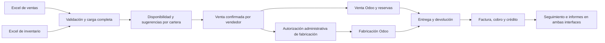

> **Estado local, 4 de octubre de 2026:** Django y Streamlit comparten funciones y permisos. El laboratorio integra Odoo Community con operación física, compras, calidad administrativa, mantenimiento y cierre contable simulados comprobados. Incluye diez clientes, ocho productos, tres puntos y 18 meses de historia sintética reconciliada. El inventario nativo revisado tiene corte local del 4 de octubre; el historial y las verificaciones relevantes están resumidos en este README. Las cuentas y archivos previos se preservan; no se acredita operación real ni validación fiscal salvadoreña.

<h1 align="center">SmartOrder AI</h1>
<p align="center"><strong>Vitali Alimentos · Ventas y seguimiento operativo</strong><br>Dos interfaces con autorización de producción e integración local Odoo Community.</p>

---

**Guía rápida:** [Qué resuelve](#qué-resuelve) · [Historial](#historial-de-implementación) · [Laboratorio](#laboratorio-integrado-con-odoo) · [Flujo](#flujo-de-trabajo) · [Datos](#archivos-excel) · [Recomendaciones](#cómo-se-obtiene-una-recomendación) · [Instalación local](#ejecutar-en-windows) · [Probar Streamlit Cloud](#probar-en-streamlit-community-cloud) · [Pruebas](#verificación)

## Qué resuelve

El vendedor consulta productos, disponibilidad y sugerencias de sus clientes asignados; confirma una venta con cantidad, precio, descuento, condiciones y **fecha comprometida de entrega**, incluida una entrega futura. No consulta históricos, fuentes ni finanzas internas. Administración autoriza fabricación por producto, independientemente de la confirmación comercial.

Django y Streamlit usan la misma fecha inicial de entrega, dentro del plazo de 365 días. Cuando el historial ya incluye hoy, empiezan en el día siguiente para disponer de un horizonte futuro. El vendedor puede elegir hoy expresamente; si la fecha no admite una sugerencia válida, puede confirmar cantidad manual con motivo. La explicación del vendedor no revela fechas del histórico ni archivos internos.

Odoo mantiene existencias, reservas, fabricación, entregas y documentos financieros. SmartOrder presenta el avance en las dos interfaces. Administración también puede descargar un XLSX y registrar que lo compartió; ese registro de archivo no sustituye las operaciones físicas de Odoo.

El proyecto ofrece dos interfaces: Django con Bootstrap y Streamlit nativo, disponible localmente y en la demo Cloud. Ambas usan las mismas cuentas, permisos, Excel, inventario y pedidos. No hace falta ejecutar el servidor Django para utilizar Streamlit. La creación inicial del administrador local desde su iniciador no requiere código secreto.

| Administración | Vendedor |
| --- | --- |
| Carga Excel y consulta históricos, filtros y gráficos administrativos. | Consulta productos, disponibilidad y sugerencias de su cartera, sin datos históricos. |
| Gestiona cuentas, carteras, sesiones y correcciones de inventario. | Confirma cantidades, precio, descuento, condiciones y entrega futura. |
| Revalida fuentes y autoriza o rechaza producción por producto. | Edita/cancela con motivo antes de ejecución cuando la configuración lo permite. |
| Relaciona catálogos y gestiona sincronización, compras, fabricación y entrega Odoo. | Consulta autorización, respuesta administrativa y seguimiento de sus ventas. |
| Consulta facturas, créditos, cobros, saldos e informes operativos. | Solicita correcciones de inventario; no consulta finanzas, costos ni credenciales. |

## Historial de implementación

- **28–29 de septiembre de 2026:** se construyó el flujo local Django con inicio seguro, ventas, inventario, pedidos y una jerarquía visual enfocada en la operación.
- **29 de septiembre:** se añadió la interfaz Streamlit nativa. Comparte las cuentas, reglas de negocio, permisos y sesiones de Django mediante el puente interno; no duplica reglas comerciales.
- **4 de octubre:** se incorporaron ventas confirmadas, autorización administrativa de fabricación por producto y seguimiento del laboratorio Odoo Community. Se ampliaron las pantallas de vendedor y administración, reportes, recuperaciones y escenarios sintéticos.
- **Estado verificado al 4 de octubre:** 83 pruebas compartidas y nueve comprobaciones de interfaz pasaron localmente. El laboratorio conserva 18 meses sintéticos, 41,680 ventas, 4,168 flujos reconciliados y el recorrido de compra, producción, entrega, devolución, facturación y cobro descrito abajo.
- **Publicación para probar Streamlit:** la app de Streamlit Community Cloud usa `app.py` como punto de entrada; ese archivo inicia la interfaz compartida de `streamlit_app.py`. El alta del primer administrador en Cloud exige un código privado en Secrets.

Las pruebas del conector Odoo se ejecutaron contra el laboratorio local y revirtieron los documentos sintéticos. No se inició Odoo HTTP en esa comprobación ni se validó una conexión pública desde Cloud.

## Laboratorio integrado con Odoo

Abre [`iniciar_laboratorio.cmd`](iniciar_laboratorio.cmd), elige Odoo y vuelve a abrirlo para elegir una interfaz. Django simulado usa **8001**, Streamlit simulado **8502** y Odoo **8079**. Las cuentas y contraseñas de prueba están en `.local-web-lab/credentials.json`; Odoo usa `vitali_admin` y la contraseña guardada en el campo `admin` de `.local-odoo/credentials.json`.

El laboratorio contiene **18 meses calendario, 41,680 ventas y 4,168 flujos diarios reconciliados**, diez clientes, ocho productos y tres puntos con tránsito. Son datos sintéticos editables, separados de las fuentes originales y de sus 2,605 filas de la primera semilla. Se conservan cinco cuentas de dos roles, con carteras 4/3/3 para los vendedores. La historia concilia compras, consumo, empaques, producción, existencias, entregas, devoluciones y pagos; no significa que se hayan importado 41,680 ventas históricas como documentos Odoo.

Conserva el recorrido **S00011 / pedido #6**: venta de 8 kg, fabricación autorizada de 3 kg, compra de reposición de 3 kg, entrega y devolución de 1 kg; factura USD 30.40, crédito USD 3.80 y cobros conciliados. El resultado es **saldo cero, 7 kg netos entregados y 1 kg pendiente** tras la devolución.

Se comprobaron ocho escenarios operativos iniciales, siete ampliados y nueve contables, además de cinco sesiones, duplicados concurrentes, caída/reintento, PDF y restauraciones. La batería compartida pasó **83 pruebas** y las pantallas **nueve**. El cierre mensual controlado genera balance y resultados desde partidas Odoo y se revierte al terminar: es una simulación del 31 de octubre, no un cierre real ya transcurrido.

La API sincroniza ventas, reservas y seguimiento. Las **ubicaciones, existencias y movimientos previstos** se exportan en un XLSX nativo fechado, que administración revisa e importa mediante el mismo servicio en ambas interfaces. El snapshot importado actualmente contiene 80 pares cliente/producto y cero stock en los tres puntos; las existencias de la bodega central se conservan en su hoja de trazabilidad y no se repiten como stock de cada cliente. No hay actualización automática de inventario ni validez fiscal/DTE salvadoreña.

## Organización de las pantallas

El resumen distingue **operación pendiente** de **ventas filtradas**: el número de pedidos por revisar no cambia al elegir cliente o período. El importe de ventas ocupa el nivel principal, seguido de productos y clientes; los gráficos y la tabla muestran los valores del mismo período. La fecha de la última venta está visible y los detalles del archivo se consultan en “Fuente y cobertura”. Un filtro sin resultados conserva el archivo activo y permite restablecer los filtros.

Las fichas del vendedor priorizan **cantidad a vender**, disponibilidad y compromiso futuro, con explicaciones permitidas para su cartera. Los históricos, archivos de origen y detalle del cálculo permanecen en administración. La lista cuenta productos pendientes, autorizados y enviados dentro de las 100 solicitudes recientes; la autorización se toma por línea.

Ambas interfaces muestran el último avance Odoo con fecha, cantidades y unidades. Una caída conserva el resultado anterior con aviso, sin afirmar actualización nueva. Un dato desconocido aparece como **Por confirmar**. Administración consulta también relaciones de catálogo, estado del conector, facturación, sugerencia frente a fabricación y diferencias de inventario importado. La diferencia de producción es producido menos sugerido; las correcciones se encadenan contra la lectura anterior del mismo archivo, cliente y producto. Sus fuentes y fechas se conservan, y las unidades se muestran por separado. Las fechas se presentan en hora de El Salvador.

## Flujo de trabajo


```mermaid
flowchart LR
    A[Excel de ventas] --> C[Validación y carga completa]
    B[Excel de inventario] --> C
    C --> D[Disponibilidad y sugerencias por cartera]
    D --> E[Venta confirmada por vendedor]
    E --> F[Venta Odoo y reservas]
    E --> G[Autorización administrativa de fabricación]
    G --> H[Fabricación Odoo]
    F --> I[Entrega y devolución]
    H --> I
    I --> J[Factura, cobro y crédito]
    J --> K[Seguimiento e informes en ambas interfaces]
```

1. Administración carga el histórico **completo** de ventas. Cada carga reemplaza la fuente activa; los archivos anteriores permanecen para trazabilidad. También puede cargar el inventario oficial y movimientos con fecha.
2. Asigna cada cliente a un vendedor y relaciona clientes, productos y unidades con Odoo. El vendedor elige su cartera y fecha de entrega; la planificación considera siete días desde esa fecha.
3. El vendedor confirma cantidades, precio, descuento y condiciones. Una referencia de demanda no ejecuta una orden por sí sola. El sistema conserva su confirmación comercial y el compromiso futuro.
4. El conector sincroniza una venta con referencia única y revisión. Odoo registra reservas de stock compartido; la venta no autoriza fabricación automáticamente.
5. Administración revisa cada línea y decide la cantidad a fabricar, con motivo al ajustarla o rechazarla. Si cambió la fuente debe revalidarla antes de autorizar.
6. Administración realiza compras, fabricación, entregas, devoluciones y cobros en Odoo. SmartOrder recupera cantidades y documentos; vendedor y administrador ven el contexto permitido en ambas interfaces.
7. El XLSX sigue disponible como alternativa de comunicación. Compartirlo registra ese paso manual; no declara mercancía producida o entregada.

## Archivos Excel

### Ventas

El Excel de ventas debe contener, como mínimo, `Fecha`, `Cliente`, `Producto`, `Cantidad_kg_unid` y `Precio_Unitario_USD`. Se admiten nombres equivalentes comunes; la carga registra las normalizaciones. Si faltan `Zona_Geografica`, `Canal_Distribucion`, `Canal_Venta` o `Categoria`, se marcan como no especificados. `Monto_Venta_USD` puede calcularse como cantidad × precio cuando no llega con valor guardado. Un importe presente que no coincide se rechaza.

**Cada Excel semanal debe contener todo el histórico que se quiere conservar**, no solo la semana nueva. El sistema valida el archivo completo y lo activa como nueva versión. No agrega silenciosamente filas de distintas entregas.

El archivo recibido `Demo_Ventas_Avicola_2025_IA_Pedidos_v2.xlsx` tiene 1,294 registros de 2025, 10 clientes y 8 productos. Sus cifras son datos del archivo de ejemplo; no prueban ventas, ahorros ni disminución de merma de Vitali. Al utilizarlo en 2026, la aplicación muestra referencias con fecha y deja las cantidades para decisión manual.

### Inventario y movimientos

Descarga la **plantilla desde “Inventario en Excel”**. La hoja `Inventario` usa `Cliente`, `Producto`, `Existencia_Disponible`, `Fecha_Corte` y `Unidad`. La hoja opcional `Movimientos` usa `Tipo`, `Cliente`, `Producto`, `Cantidad` y `Fecha`; `Tipo` admite `Entrada` y `Compromiso_Cliente`.

Hoy el cruce se hace por **cliente y producto**. El Excel de ventas no contiene sucursal, SKU ni unidad oficial. Administración solo debe marcar la equivalencia de unidades cuando la haya comprobado. Sin unidad confirmada o inventario con fecha de corte de hoy, la aplicación no propone una cantidad automática. Las correcciones de stock aprobadas se guardan como ajustes, sin alterar el Excel importado.

En el laboratorio, [`exportar_inventario_odoo.py`](scripts/exportar_inventario_odoo.py) agrega hojas administrativas con identificadores, ubicaciones, unidades, stock físico/reservado/disponible y trazas de asignación. Las hojas `Inventario`/`Movimientos` son compatibles con el importador común. El archivo se revisa antes de activarlo; una importación posterior conserva las fuentes y pedidos anteriores y requiere revalidarlos cuando corresponda. El Excel histórico con cuotas de planificación de 2 por cliente sigue conservado; esas cuotas no se presentan como stock físico del punto.

## Cómo se obtiene una recomendación

La demanda corresponde a los **siete días que empiezan en la fecha de entrega**. La app compara cinco métodos: ventas de los últimos 7 días, promedios de 28 y 56 días, mismos días del año anterior cuando existen, y XGBoost. XGBoost es un candidato, no una elección forzada.

Cuando hay ventas recientes, completas y verificadas, se prueban los métodos en 16 semanas comparables: ocho para escoger y ocho posteriores para auditar. La selección se evalúa por producto con error absoluto, WAPE y exceso de pronóstico frente al promedio de 28 días. Solo se permite una sugerencia automática para un producto que supera el control independiente y dispone de inventario actual con unidad confirmada. Una serie sin evidencia suficiente queda en modo manual.

La cantidad orientativa cubre la mayor entre demanda prevista y compromisos de clientes en la semana, restando inventario proyectado a la entrega (existencia actual + entradas previas − compromisos previos). La cantidad nunca baja de cero. El vendedor recibe cantidad orientativa y explicación permitida; administración conserva fuentes y detalle histórico. Los códigos, unidades y receta del laboratorio están identificados como simulados; no se atribuyen a la planta real.

**Interpretación:** el Excel registra ventas, no ventas perdidas por agotados ni merma. Por eso el sistema no afirma que una recomendación haya reducido sobreproducción. Tampoco suma cantidades de productos con unidades distintas en un indicador global.

## Ejecutar en Windows

**Requisitos:** Windows, Python 3.10 o posterior y conexión a Internet para la instalación inicial de dependencias.

1. Descarga o abre esta carpeta en la PC.
2. Haz doble clic en [`iniciar_smartorder.cmd`](iniciar_smartorder.cmd). La primera vez crea `.venv-web`, instala dependencias y prepara la base local.
3. Abre la dirección que muestra la ventana: normalmente [http://127.0.0.1:8000/](http://127.0.0.1:8000/). Si Windows reserva ese puerto o ya está ocupado, el iniciador utiliza [http://127.0.0.1:8050/](http://127.0.0.1:8050/). Mantén abierta la ventana del servidor mientras uses la aplicación. Para detenerla, pulsa `Ctrl+C`.
4. Si no hay cuentas anteriores, crea el administrador inicial en la pantalla de configuración. Después entra, carga ventas, crea un vendedor y asígnale clientes.

La base, los archivos cargados y la clave local se guardan en `.local-web/`, que Git ignora. Si existe la antigua `.local/smartorder.sqlite3` y solo contiene cuentas y asignaciones, el inicio importa esas cuentas **en modo lectura** y conserva sus contraseñas. La base anterior no se modifica. Si contiene pedidos u otros datos operativos, el inicio se detiene para evitar una migración incompleta; conserva ambos directorios y revisa el mensaje mostrado.

Para elegir otro puerto al usar el iniciador, define `$env:SMARTORDER_PORT = "8500"` en PowerShell y ejecuta `.\iniciar_smartorder.cmd`.

También puedes iniciarlo desde PowerShell, dentro del proyecto:

```powershell
py -3 -m venv .venv-web
.\.venv-web\Scripts\python.exe -m pip install -r requirements.txt
.\.venv-web\Scripts\python.exe manage.py migrate
.\.venv-web\Scripts\python.exe manage.py import_legacy_local
.\.venv-web\Scripts\python.exe manage.py runserver 127.0.0.1:8000 --noreload
```

Si no hay base antigua, `import_legacy_local` informa que no hay cuentas y continúa. Para una base nueva independiente, omite ese paso.

## Ejecutar la versión Streamlit

Haz doble clic en [`iniciar_streamlit.cmd`](iniciar_streamlit.cmd) y abre **http://127.0.0.1:8501/**. El iniciador instala las dependencias, prepara la misma base local y permite crear el administrador inicial cuando aún no existen cuentas. Usa las mismas credenciales que en Django.

**El servidor no se instala como servicio ni se inicia con Windows.** Solo permanece activo mientras esa ventana esté ejecutándose. Pulsa `Ctrl+C` para detenerlo; para volver a entrar, ejecuta el iniciador otra vez. Puedes cambiar el puerto con `$env:SMARTORDER_STREAMLIT_PORT = "8502"`.

Inicio manual desde PowerShell:

```powershell
.\.venv-web\Scripts\python.exe -m pip install -r requirements-streamlit.txt
$env:SMARTORDER_ALLOW_LOCAL_SETUP = "1"
.\.venv-web\Scripts\python.exe -m streamlit run streamlit_app.py --server.address 127.0.0.1 --server.port 8501 --server.headless true
```

Después de editar el código, detén y vuelve a iniciar Streamlit para cargar los cambios; la recarga automática está desactivada para mantener consistente el registro de modelos de Django.

Streamlit y Django incluyen productos, venta, autorización por producto, correcciones, importaciones, gestión de cuentas, XLSX, conexión Odoo, seguimiento e informes. Los históricos, gráficos, configuración y finanzas son administrativos. Streamlit usa controles nativos y Django conserva Bootstrap; ambos comparten permisos y reglas. Las métricas técnicas del modelo no se presentan como resultados económicos reales.

## Probar en Streamlit Community Cloud

La [demo de Streamlit Cloud](https://smartorder-vitali-prueba.streamlit.app/) carga `streamlit_app.py` y comparte la lógica de negocio y los permisos de Django. El vendedor consulta su cartera, productos, disponibilidad y sugerencias para confirmar pedidos; administración gestiona datos y cuentas, revisa ventas y autoriza producción por separado.

Para crear la primera cuenta, agrega en **App settings → Secrets** una clave Django y un código de instalación distintos. Genera cada valor por separado en PowerShell con `python -c "import secrets; print(secrets.token_urlsafe(48))"` y guárdalos solo en Secrets:

```toml
SMARTORDER_SECRET_KEY = "<clave-aleatoria-generada>"
SMARTORDER_SETUP_CODE = "<codigo-aleatorio-de-32-caracteres-o-mas>"
```

Al abrir la app, crea el primer administrador con ese código y una contraseña de al menos 12 caracteres. El código solo autoriza la creación de la primera cuenta; cuando ya existe un usuario, el inicio cambia al formulario de acceso. No lo escribas en Git, capturas públicas ni mensajes.

Esta demo usa datos sintéticos y el almacenamiento de archivos de Streamlit Community Cloud no es persistente; no cargues ventas, inventario, cuentas ni credenciales reales. El laboratorio Odoo se ejecuta localmente y no tiene una conexión pública configurada desde Cloud. Streamlit está incluido en `requirements.txt`; `requirements-streamlit.txt` es el acceso equivalente para el iniciador local.

Para avisos desde esta interfaz, `SMARTORDER_STREAMLIT_URL` determina el enlace de Telegram; el iniciador lo ajusta al puerto elegido. Los avisos siguen ligados a acciones concretas, sin proceso permanente.

## Avisos internos por Telegram

Es opcional. Define `SMARTORDER_TELEGRAM_BOT_TOKEN` y `SMARTORDER_TELEGRAM_CHAT_ID` como variables de entorno **antes de iniciar**. Al enviar un pedido, revisar un producto o solicitar una corrección, la aplicación intenta mandar un resumen y un enlace. No adjunta datos comerciales ni ejecuta tareas mientras la PC está apagada. El enlace `127.0.0.1` se abre en la misma PC donde corre el servidor. Un fallo de Telegram no cancela el pedido y queda registrado.

WhatsApp y envíos automáticos externos no forman parte de esta versión local; requieren cuentas, consentimiento y diseño de entrega adicionales.

## Verificación

Desde la carpeta del proyecto:

```powershell
.\.venv-web\Scripts\python.exe manage.py check
.\.venv-web\Scripts\python.exe manage.py makemigrations --check --dry-run
.\.venv-web\Scripts\python.exe manage.py test operations tests
.\.venv-web\Scripts\python.exe -m pip check
```

La batería ejecutada el 4 de octubre con `manage.py test operations tests --noinput` pasó **83 pruebas en 61.545 segundos**, incluidas las dos comprobaciones nuevas del alta inicial remota con código privado. Cubre ETL, recomendaciones, permisos, ventas, edición/cancelación, autorización, exportación, contextos Odoo, comparación de producción, correcciones encadenadas, fecha inicial compartida y cantidad manual explícita en ambas interfaces. Las pruebas de interfaz usan bases temporales; las solicitudes del conector se aíslan en las pruebas. También pasó `scripts/comprobar_conector_odoo.py` contra el addon de `vitali_lab`; sus documentos sintéticos se revierten al terminar. En esa comprobación no se inició el servidor HTTP de Odoo, por lo que no acredita una transferencia HTTP en vivo. Los límites de simulación y las fechas de verificación indicados en este README forman parte del historial del prototipo.

## Estructura y límites de uso

| Ruta | Responsabilidad |
| --- | --- |
| `operations/` | Roles, modelos, pantallas Bootstrap, ETL persistido y flujo de pedidos. |
| `operations/odoo.py` | Conector local, referencias/revisiones, snapshot e informes compartidos. |
| `odoo_addons/vitali_lab/` | Personalización Odoo y API restringida, sin modificar su núcleo. |
| `scripts/` | Preparación, escenarios, resiliencia, PDF y recuperación del laboratorio. |
| `smartorder/data.py` | Lectura y validación del Excel de ventas. |
| `smartorder/inventory.py` | Lectura y plantilla de inventario. |
| `smartorder/recommendations.py` | Comparación de métodos, backtest y referencias. |
| `smartorder/orders.py` | XLSX seguro para producción. |
| `smartorder/notifications.py` | Avisos opcionales al personal interno. |
| `vitali_web/` | Configuración del servidor local. |

La prueba pública de Streamlit no convierte la app en una instalación de uso compartido: usa SQLite y archivos locales temporales. El servidor Django de desarrollo no debe exponerse a Internet.

### Verificación de Streamlit

Con las dependencias instaladas, `python manage.py test operations tests` también ejecuta las comprobaciones de la interfaz nativa: acceso, navegación por rol, filtros sin ventas y pantallas administrativas. La prueba del puente comprueba permisos, pedido, revisión y exportación con sesión persistida, y la invalidación de sesión al cambiar la contraseña.
